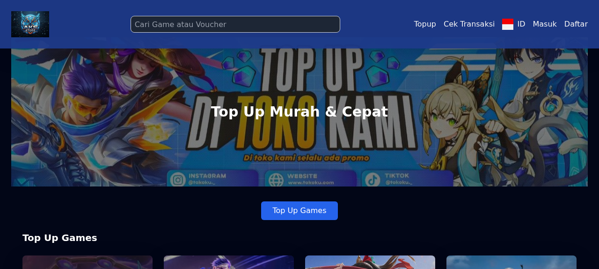
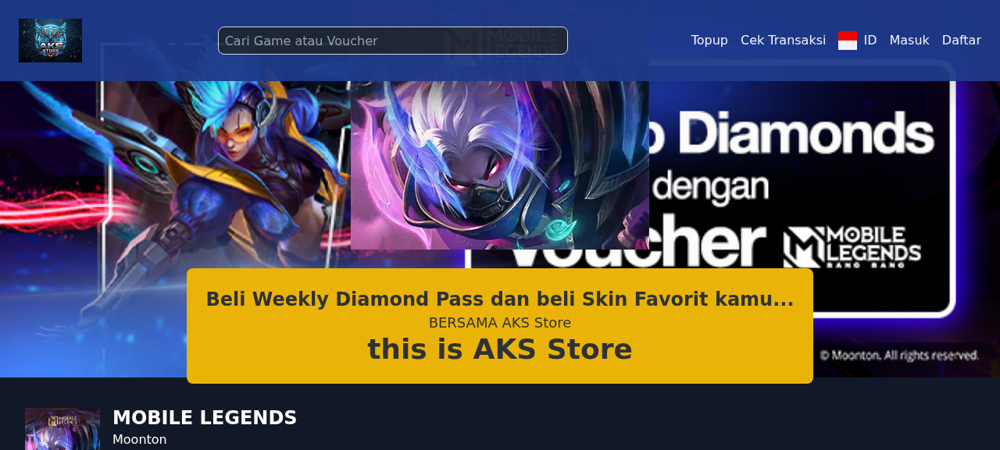
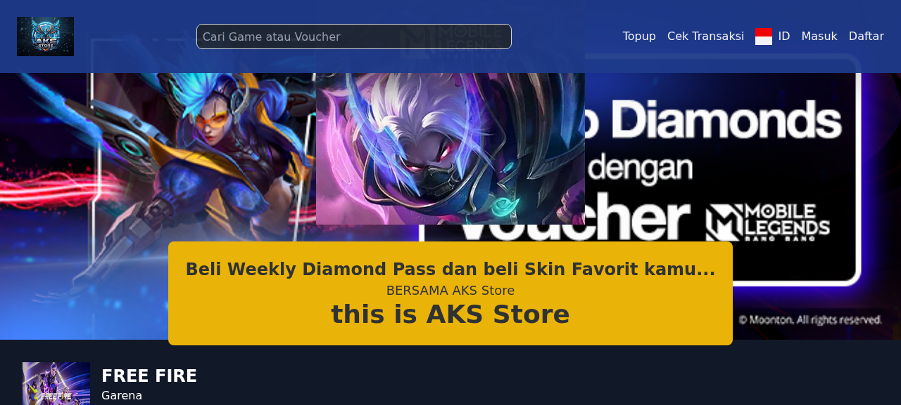
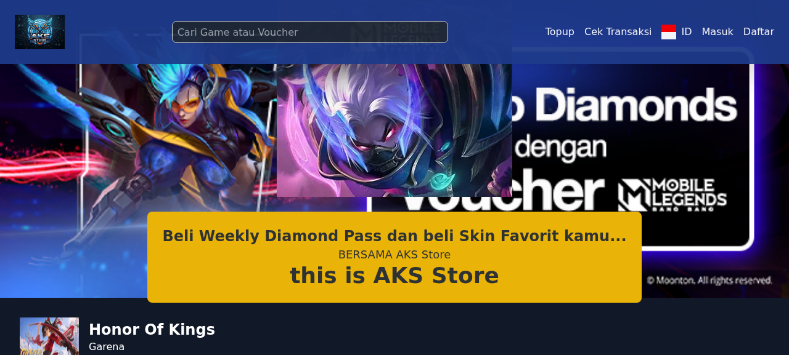
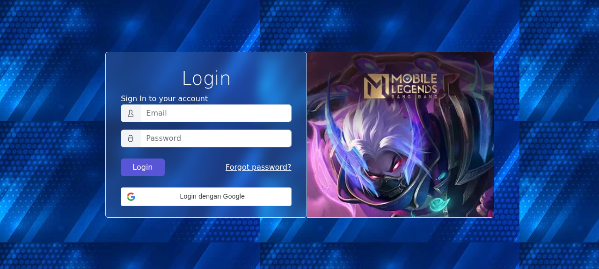
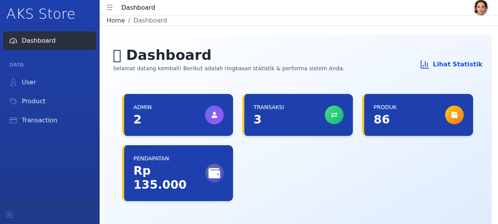

# AKS Store — Top Up Game

Platform top-up game (Mobile Legends, Free Fire, Honor of Kings, PUBG) dengan integrasi Midtrans Payment Gateway & Google OAuth.

---

## 📸 Screenshot

| Beranda | Mobile Legends | Free Fire |
|---------|----------------|-----------|
|  |  |  |

| Honor of Kings | Login | Dashboard Admin |
|----------------|-------|-----------------|
|  |  |  |

---

## 📋 Daftar Isi

- [Cara Pakai](#cara-pakai)
- [User Flow](#user-flow)
- [Admin Dashboard](#admin-dashboard)
- [Troubleshooting Database](#troubleshooting-database-db-kosong)
- [Stack](#stack)
- [Struktur Folder](#struktur-folder)
- [API Routes](#api-routes)
- [Google OAuth](#google-oauth)
- [Midtrans](#midtrans)
- [Environment Variables](#environment-variables)

---

## Cara Pakai

> **⚠️ PENTING:** Jangan double-click file `.sh` — itu script Linux, bakal kebuka Notepad doang.  
> Gunakan **PowerShell** (klik kanan > Run with PowerShell) untuk file `.ps1`.

### Windows
```powershell
git clone https://github.com/IkramRamadhan08/App_TopUp_Game.git
cd App_TopUp_Game
.\setup.ps1    # 1x aja (install semua + seed data)
.\run.ps1      # jalanin server tiap mau pake
```

### Linux / macOS
```bash
git clone https://github.com/IkramRamadhan08/App_TopUp_Game.git
cd App_TopUp_Game
chmod +x setup.sh run.sh
./setup.sh
./run.sh
```

Buka **http://localhost:5173**

### Admin Login
- Email: `admin@example.com`
- Password: `admin123`

### Prerequisites

| Software | Download | Catatan |
|----------|----------|---------|
| **PHP** 8.1+ | https://windows.php.net/download/ | Pastikan PATH terdaftar |
| **Composer** | https://getcomposer.org/download/ | |
| **Node.js** 18+ | https://nodejs.org/ | Termasuk npm |
| **MySQL** / XAMPP | https://dev.mysql.com/downloads/ | XAMPP: start MySQL aja |

---

## User Flow

### 1. Halaman Utama (Beranda)
- Tampilan banner promo + grid game (Mobile Legends, Free Fire, Honor of Kings, PUBG)
- Ada fitur **cari game** di navbar
- Tombol **Top Up Games** buat scroll ke daftar game

### 2. Pilih Game
Klik salah satu game, masuk ke halaman top-up berisi:
- **Section 1 — Masukkan Data Akun**: Nama, ID Game, Server
- **Section 2 — Pilih Nominal**: Daftar harga diamond/token/UC
- **Sidebar**: Atur jumlah pembelian, lihat total harga
- **Section 5 — Detail Kontak**: No. WhatsApp

### 3. Konfirmasi Pesanan
Klik **Pesan** → modal konfirmasi muncul:
- Ringkasan data akun, nominal, total harga
- Harus centang **Ketentuan Layanan** sebelum bisa lanjut

### 4. Pembayaran (Midtrans Snap)
Klik **Pesan Sekarang** → popup Midtrans Snap muncul:
- Pilih metode pembayaran (DANA, GoPay, OVO, transfer bank, QRIS, dll)
- Bayar, status otomatis terupdate

### 5. Cek Invoice
- Klik **Cek Transaksi** di navbar
- Masukkan nomor invoice buat lihat status pembayaran

---

## Admin Dashboard

Akses di `http://localhost:5173/login`.

### Login
- Login pake email & password **atau** **Google OAuth** (klik tombol Google)
- Kalau Google OAuth, muncul popup pilih akun Google

### Halaman Admin (setelah login)
| Halaman | Fitur |
|---------|-------|
| **Dashboard** | Statistik: total user, transaksi, produk, pendapatan |
| **Data Transaksi** | CRUD transaksi, filter & cari, update status pembayaran |
| **Data Produk** | CRUD produk (diamond/token/UC per game) |
| **Data User** | Lihat semua user yang terdaftar |

### Stats Dashboard
- Cards: Total Users, Total Transaksi, Total Produk, Total Pendapatan
- Data real-time dari database

---

## Troubleshooting Database (DB Kosong)

Kalo abis jalanin `setup.ps1` tapi database kosong (gak ada tabel):

### 1. Pastikan MySQL sudah jalan
- **XAMPP**: buka XAMPP Control Panel → klik **Start** pada MySQL
- **MySQL standalone**: `services.msc` → cari **MySQL** → **Running**

### 2. Cek `api-topup/.env`
```env
DB_CONNECTION=mysql
DB_HOST=127.0.0.1
DB_PORT=3306
DB_DATABASE=api_topup
DB_USERNAME=root
DB_PASSWORD=
```
> Default XAMPP: `root` tanpa password. Kalo MySQL pake password, isi `DB_PASSWORD`.

### 3. Migration manual
```powershell
cd api-topup
php artisan migrate --seed --force
```

### 4. Reset database
```powershell
php artisan migrate:fresh --seed --force
```

### 5. Selesai
Jalanin ulang `.\run.ps1`, buka `http://localhost:5173`.

---

## Stack

| Layer | Teknologi |
|-------|-----------|
| **Frontend** | React 19, Vite, Tailwind CSS, CoreUI |
| **Backend** | Laravel 11, PHP 8.1+ |
| **Database** | MySQL |
| **Payment** | Midtrans Snap (sandbox) |
| **Auth** | Sanctum token + Google OAuth |

---

## Struktur Folder

```
App_TopUp_Game/
├── api-topup/                   # Backend API (Laravel)
│   ├── app/Http/Controllers/    # Controllers
│   ├── config/                  # Config (cors, midtrans, dll)
│   ├── database/migrations/     # Migrasi database
│   ├── routes/api.php           # API routes
│   └── .env                     # Environment variables
├── top-up/                      # Frontend (React + Vite)
│   ├── src/
│   │   ├── components/          # Komponen publik (Nav, Footer, Pages)
│   │   ├── admin/               # Admin panel (dashboard, CRUD)
│   │   └── assets/              # Gambar, icon
│   └── .env                     # Frontend env vars
├── Gambar/                      # Screenshot
├── setup.ps1                    # Setup Windows
├── setup.sh                     # Setup Linux/macOS
├── run.ps1                      # Jalankan server (Windows)
└── run.sh                       # Jalankan server (Linux/macOS)
```

---

## API Routes

| Method | Endpoint | Auth | Fungsi |
|--------|----------|------|--------|
| POST | `/api/register` | - | Register user |
| POST | `/api/login` | - | Login user |
| POST | `/api/admin/google-login` | - | Login Google OAuth |
| GET | `/api/products` | - | Daftar produk |
| GET | `/api/products?type={game}` | - | Filter produk per game |
| POST | `/api/transaksi` | - | Buat transaksi baru |
| GET | `/api/cek-status/{invoice}` | - | Cek status transaksi |
| GET | `/api/stats` | Sanctum | Statistik dashboard |
| GET | `/api/transaksi` | Sanctum | Data transaksi (admin) |
| PUT | `/api/transaksi/{id}` | Sanctum | Update transaksi |
| DELETE | `/api/transaksi/{id}` | Sanctum | Hapus transaksi |
| GET | `/api/total-pendapatan` | Sanctum | Total pendapatan |
| GET | `/api/transaksi/users` | Sanctum | Data user |

---

## Google OAuth

### Setup
1. Buka [Google Cloud Console](https://console.cloud.google.com/)
2. **APIs & Services** > **Credentials** > **Create Credentials** > **OAuth client ID**
3. Pilih **Web application**
4. **Authorized JavaScript origins**: `http://localhost:5173`
5. **Authorized redirect URIs**: `http://localhost:5173`
6. Klik **Create**, dapet **Client ID**
7. Isi di 2 file:
   - **`api-topup/.env`** → `GOOGLE_CLIENT_ID=...`
   - **`top-up/.env`** → `VITE_GOOGLE_CLIENT_ID=...`

### Cara Kerja
- Frontend pake [Google Identity Services (GIS)](https://accounts.google.com/gsi/client)
- User klik tombol Google → muncul popup pilih akun → dapet credential token
- Token dikirim ke `POST /api/admin/google-login`
- Backend verify pake `google/apiclient`
- Kalau valid: bikin user baru / login, kasih token Sanctum

---

## Midtrans

1. Daftar di https://dashboard.midtrans.com/
2. **Settings** > **Access Keys** → ambil **Server Key** & **Client Key**
3. Isi di `api-topup/.env`:
   ```
   MIDTRANS_SERVER_KEY=Mid-server-xxx
   MIDTRANS_CLIENT_KEY=Mid-client-xxx
   MIDTRANS_IS_PRODUCTION=false
   ```
4. Pembayaran pake **Midtrans Snap** (popup pembayaran)
5. User bisa milih metode: DANA, GoPay, OVO, transfer bank, QRIS, dll
6. Status transaksi diupdate otomatis via callback

---

## Environment Variables

### `api-topup/.env` (Backend)

| Variable | Fungsi | Default |
|----------|--------|---------|
| `DB_DATABASE` | Nama database | `api_topup` |
| `DB_USERNAME` | User MySQL | `root` |
| `DB_PASSWORD` | Password MySQL | *(kosong)* |
| `MIDTRANS_SERVER_KEY` | Server key Midtrans | *(sandbox)* |
| `MIDTRANS_CLIENT_KEY` | Client key Midtrans | *(sandbox)* |
| `GOOGLE_CLIENT_ID` | Client ID Google OAuth | *(isi dari Google)* |

### `top-up/.env` (Frontend)

| Variable | Fungsi | Default |
|----------|--------|---------|
| `VITE_GOOGLE_CLIENT_ID` | Client ID Google OAuth | *(sama dengan backend)* |

---

## Game Tersedia

| Game | Mata Uang | Halaman |
|------|-----------|---------|
| **Mobile Legends** | Diamond, Starlight Member | `/DiamondMl` |
| **Free Fire** | Diamond | `/DiamondEpep` |
| **Honor of Kings** | Token | `/DiamonHok` |
| **PUBG Mobile** | UC, Royal Pass | `/DiamondPubg` |
